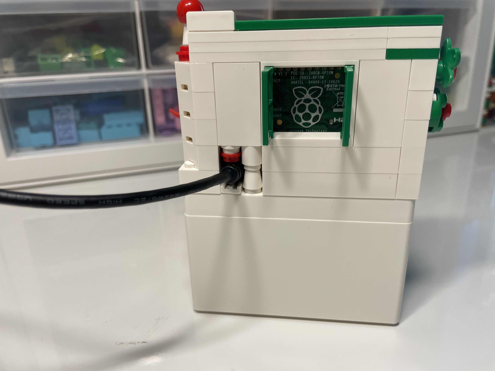

# Badge of Honor
Use Pimoroni's inky pHat to show off the star and fork counts of your favorite GitHub project. 

In my case, [Drake](https://drake.mit.edu/).


## Why? 
- Looks cute! Perfect for mod with Lego and makes great (holiday) gifts.



- The display is eink, so the image stays on even without power; but with power the counts also get pulled every a few hours.
- It's not just your regular panda-colored eink 🐼; it got red 🎈 too!
<!-- - Get youngsters into tinckering...  -->

## What?
#### Hardware
- Pimoroni's [inky pHat](https://www.adafruit.com/product/3743)
- Raspberry pi (any 20-pin version works)
- MicroSD card
- MicroUSB cable
#### Software
- Raspbian OS
- Inky pHAT software (one line install) 
```bash
curl https://get.pimoroni.com/inky | bash
```

## How?
It's helpful to follow Pimoroni's [tutorial](https://learn.pimoroni.com/article/getting-started-with-inky-phat), particularly the name tag one, since our goal is similarly to draw some non-static texts on top of a static background. (The tutorial also gets all the prerequisites installed.) 
#### Background prep
But, in the name tag example, the background can be drawn 'on-the-go' as it is simply a red strip, which is easily represented as an array of red/fixed pixels. We'd like our background to be a bit more customized/fancier, which requires a little preparation. Because pHat is a bit picky in terms of acceptable images:
>They should be PNG-8 images, 250x122 pixels, and in indexed colour mode with a palette of just three colours - white, red and black (in that order!).

So it takes a few steps to get the image right:
1. We need to create visually satisfying background image; this can be done in Photoshop or the free [Gimp](https://www.gimp.org/). In this step, we just want the image  to 1) looks good to our eyes , and 2) be a 250 by 122 image, regular PNG or JPG both work.

2. Feed our image into `convert.py` script, to convert it into the specification pHat accepts. For instance, say the image we created in step 1 is named `drake.png`, then running `python3 convert.py -f drake.png` outputs/saves an image named `inky-drake.png`.

#### Fire up to pHat
To get sth like the Gif demo, run `python3 main.py`. The script has a few things hard coded, but easily modifiable:
- Your favorite Git repo address
- The background you created from the step above
- Error info for when Pi is having WiFi connection issue, in which case, a QR code is shown, like 
, 
which when scanned directs to [Wifi Config Tutorial](https://github.com/shensquared/Badge-of-Honor/blob/main/Config%20WiFi.md).


As a btw, the `disp_images.py` script simply displays a static background image onto pHat (like the Happy Holiday one shown in the Lego picture). The usage is simply (using the snowman pic as an example):
```
python3 disp_images.py -f inky-snowman.png

```