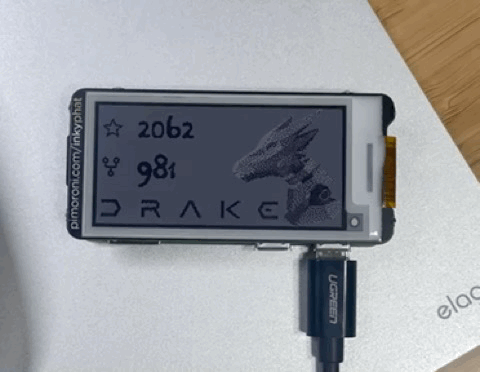

# Badge of Honor
Use Pimoroni's inky pHat to show off the star and fork counts of your favorite GitHub project. 

In my case, [Drake](https://drake.mit.edu/).

## Why? 
- Looks cute! Perfect for mod with Lego and makes great (holiday) gift.
- The display is eink, so the image stays on even without power; but with power the counts also get pulled every a few hours.
- It's not just your regular panda-colored eink; it got ```diff -Red-``` too!
<!-- - Get youngsters into tinckering...  -->

## What?
#### Hardware
- Pimoroni's [inky pHat](https://www.adafruit.com/product/3743)
- Raspberry pi (any 20-pin version works)
- MicroSD card
- MicroUSB cable
#### Software
- Raspbian OS
- Inky pHAT software (one line install) 
```bash
curl https://get.pimoroni.com/inky | bash
```

## How?
It's helpful to follow Pimoroni's [tutorial](https://learn.pimoroni.com/article/getting-started-with-inky-phat), particularly the name tag one, since our goal is similarly to draw some non-static texts on top of a static background. But, in the name tag example, the background can be drawn 'on-the-go' as it is simply a red strip, i.e. an array of red pixels. We'd like something a bit more customized/fancier than a bland color background, which requires some before-hand image preparation.

pHat is a bit picky in terms of acceptable images:
>They should be PNG-8 images, 250x122 pixels, and in indexed colour mode with a palette of just three colours - white, red and black (in that order!).

So it takes a few steps to get the image right. First, we need to create visually satisfying background image; this can be done in Photoshop or the free [Gimp](https://www.gimp.org/). In this step, we just want the image  to 1) looks good to our eyes , and 2) be a 250 by 122, regular PNG.

Next, feed our image into `convert.py` script, to convert it into the specification pHat accepts.  For instance, running  `python3 convert.py -f drake.png` outputs an image named with prefix `inky-drake.png`. 


